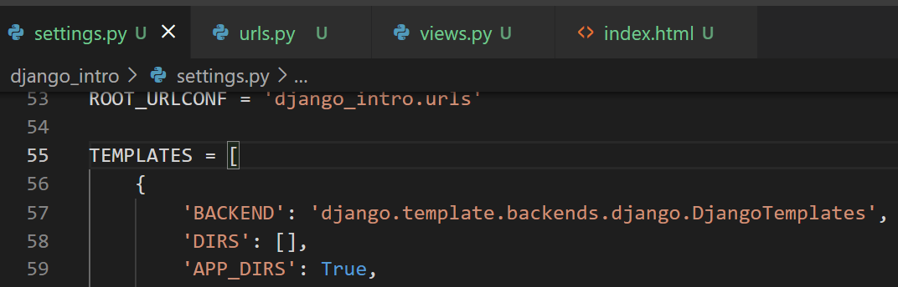
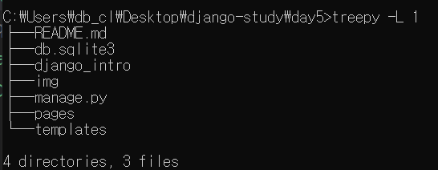
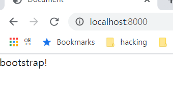
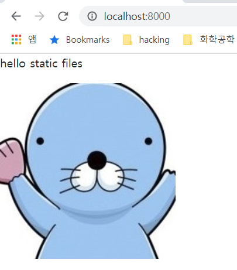

# day06: template 상속, static file 제공

## 복습([링크](../day05/README.md))

- post method
- bootstrap


## 오늘 학습 내용

키워드

- template 상속
  - base.html을 만들어서 공통적으로 다른 파일들에서 사용
- static file 제공
  - css, image, font, js 등 동일한 동작을 하는 파일들을 static file이라고 함


## template 상속

template의 일부를 공통으로 사용하고 싶은 경우에 template 상속을 사용합니다.

예를 들어서 페이지의 상단에 같은 메뉴 바를 노출시키고 싶다면, template 상속을 이용합니다.

settings.py에 TEMPLATES 부분을 보시면,

[](https://github.com/dwlim-nota/django-study/blob/main/day5/img/README/image-20210527075426165.png)

위와 같이 DIRS가 있습니다. 여기에 폴더를 추가해 주시면, 여기에서 템플릿을 찾는 추가적인 폴더가 됩니다.

다음과 같이 변경해줍니다.

```
TEMPLATES = [
    {
        'BACKEND': 'django.template.backends.django.DjangoTemplates',
        'DIRS': [Path(BASE_DIR) / "templates"], # os.path.join(BASE_DIR, "templates") 가능합니다.
        'APP_DIRS': True,
        'OPTIONS': {
... 생략
```

os.path.join보다 pathlib의 Path 구문을 사용하는 것이 더 권장됩니다.

templates 폴더를 pages 폴더가 있는 것과 같은 레벨로 생성해 줍니다.

[](https://github.com/dwlim-nota/django-study/blob/main/day5/img/README/image-20210527075924350.png)

위와 같은 구조가 됩니다.

새로 만든 templates 밑에 base.html을 넣어줍니다.

아까 만든 pages/templates/pages/index.html의 내용을 잘라서 붙여넣어줍니다.

아래와 같이 base.html을 변경해줍니다.

```
<!-- templates/base.html -->
<!DOCTYPE html>
<html lang="en">
<head>
    <meta charset="UTF-8">
    <meta http-equiv="X-UA-Compatible" content="IE=edge">
    <meta name="viewport" content="width=device-width, initial-scale=1.0">
    <title>Document</title>
    <link href="https://cdn.jsdelivr.net/npm/bootstrap@5.0.1/dist/css/bootstrap.min.css" rel="stylesheet" integrity="sha384-+0n0xVW2eSR5OomGNYDnhzAbDsOXxcvSN1TPprVMTNDbiYZCxYbOOl7+AMvyTG2x" crossorigin="anonymous">
</head>
<body>
    
    
    <script src="https://cdn.jsdelivr.net/npm/bootstrap@5.0.1/dist/js/bootstrap.bundle.min.js" integrity="sha384-gtEjrD/SeCtmISkJkNUaaKMoLD0//ElJ19smozuHV6z3Iehds+3Ulb9Bn9Plx0x4" crossorigin="anonymous"></script>
</body>
</html>
```

index.html도 다음과 같이 변경해줍니다.

```
<!-- pages/templates/pages/index.html -->


bootstrap!

```

template 상속이 적용되었고, 결과를 확인하면 다음과 같이 부트스트랩이 적용된 bootstrap!이라는 문자열을 볼 수 있습니다.

[](https://github.com/dwlim-nota/django-study/blob/main/day5/img/README/image-20210527080229680.png)

부트스트랩 사이트에 들어가서 components -> navbar 에 들어가서

적당한 소스코드를 카피해서 base.html에 block content의 윗 부분에 붙여넣어 주면 적용이 됩니다.


### static file 제공


index.html 파일을 다음과 같이 수정하면, 내용을 볼 수 있습니다.

```
<!-- pages/templates/pages/index.html -->





hello static files


```

pages/static/pages/img/bono1.jpg

위의 폴더에 그림 파일을 다운로드 받아서 집어넣어주고,

`python manage.py runserver`로 서버를 실행시켜 줍니다.

[](https://github.com/dwlim-nota/django-study/blob/main/day6/img/README/image-20210528100611611.png)

위와 같이 그림이 실행되어 있는 것을 볼 수 있습니다.

django에서 static file을 사용할 때에는, `` 구문으로 static file을 사용할 것이라고 선언해주고, `` 이 구문으로 실제 static file을 제공할 url을 만들어서, 그 url을 집어넣어 주는 방식입니다.

## 다음 시간 내용

- ORM
